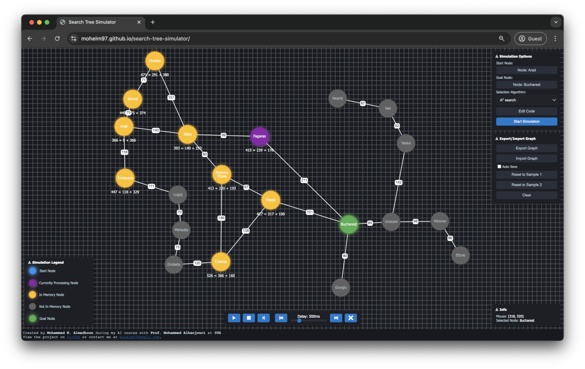

# Search Tree Simulator

## Overview

The **Search Tree Simulator** is an interactive web-based tool designed to help users visualize and understand various tree search algorithms step by step. The project simulates popular search algorithms like Breadth-First Search, Depth-First Search, A\*, and more, allowing users to observe the process of traversing through a tree-like structure.



## Demo

You can try out the **Search Tree Simulator** live on GitHub Pages here:

[Search Tree Simulator Demo](https://mohelm97.github.io/search-tree-simulator/)

## Features

-   Visualize the execution of different search algorithms.
-   Step-by-step traversal of nodes.
-   Supports multiple algorithms including Breadth-First Search, Uniform-Cost Search, Greedy Best-First Search, and A\*.
-   Customizable strategy template for users to experiment and create their own algorithms.
-   Use the **context menu** to easily add nodes and connections to the tree.

## Algorithms Included

-   **Breadth-first Search (BFS)**
-   **Uniform-Cost Search**
-   **Depth-First Search (DFS)**
-   **Depth-First Search (Avoid Loops)**
-   **Iterative Deepening Search**
-   **Greedy Best-First Search**
-   **A\* Search**
-   **Custom Strategy** (blank template to allow users to experiment)

## How to Use

1. Open the simulator in your browser.
2. Select an algorithm from the list.
3. Press "Start" to begin the simulation.
4. Watch the nodes being explored in real-time as the algorithm runs step-by-step.
5. **Right-click** on the canvas to open the context menu and add new nodes and connections.
6. Modify and experiment with the custom strategy to create your own tree search logic.

## Project Setup

To run this project locally, follow these steps:

1. Clone the repository:

    ```bash
    git clone https://github.com/Mohelm97/search-tree-simulator.git
    ```

2. Install the dependencies:

    ```bash
    cd search-tree-simulator
    npm install
    ```

3. Start the development server:

    ```bash
    npm run dev
    ```

4. Open your browser and go to `http://localhost:8080`.

## License

This project is licensed under the [MIT License](https://opensource.org/licenses/MIT).

## Created By

**Mohammed N. Almadhoun**  
Created during an AI course with Prof. Mohammed Alhanjouri at the Islamic University of Gaza (IUG).  
Contact: [mohelm97@gmail.com](mailto:mohelm97@gmail.com)
